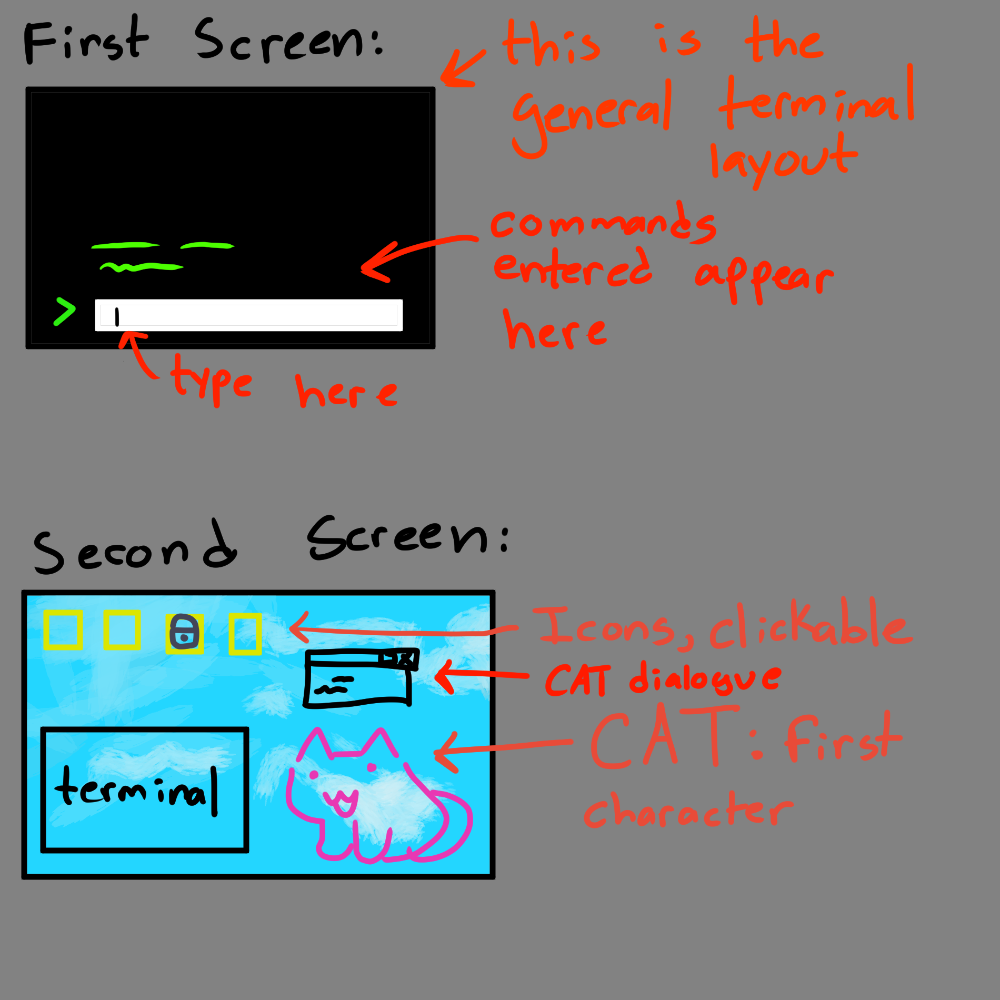
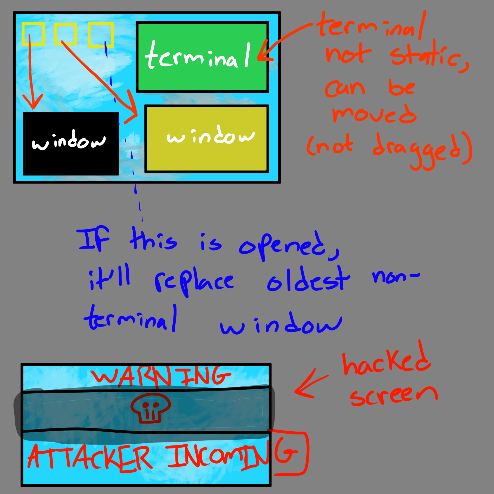

# Terminal 0

## Elevator Pitch

Terminal 0 is a video game dedicated to teaching users how to navigate a new operating system and investigate a system using basic cyber concepts.

## Influences (Brief)

- Pony Island:
  - Medium: Video Game
  - Explanation: Pony Island is the type of game we want to make in terms of visuals and mechanics.
- Kali Linux:
  - Medium: Virtual Machine
  - Explanation: Kali Linux is a VM made for pentesting and security endeavors. We’ll be taking elements of the bash shell for Terminal 0.

## Core Gameplay Mechanics (Brief)

- GUI icons are locked until the player progresses enough to unlock them/make them clickable.
- Player will unlock the GUI icons through terminal tasks/puzzles and progressing through the story.
- GUI icons are files or apps that will provide other user logins for the player to use. If logged into another user, they get access to other content to further the story.
- One GUI icon will be dedicated to a progress log to store information the player has collected so far (in case they forget or get overwhelmed).

# Learning Aspects

## Learning Domains

- Introduction to terminal environment
- Introduction to basic forensics

## Target Audiences

- Intermediate-level average computer consumer who wants to learn more about terminal environments and basic cybersecurity.
- Targeted towards middle/high school students, but is appropriate for college students.

## Target Contexts

- Short enough to have one class period dedicated to it in a public school setting (50 minutes - 1 hour).
- Little to no audio, suitable for school-issued Chromebooks.
- Designed to be given as an assignment for a computer lab, non-course specific.

## Learning Objectives

- Basic Cybersecurity: By end of the game, players will be able to apply basic cyber security concepts
- File Properties: By end of the game, players should be able to explain file metadata and what it is used for.
- Terminal Navigation: By the end of the game, players should be able to experiment with navigating a filesystem using a terminal on a real computer.

## Prerequisite Knowledge

- Must be able to read at middle school level.
- Must be familiar with a computer on an average consumer level (no terminal, knows how to open chrome/safari, etc).
- Must know that there are files on computers.

## Assessment Measures

- Players will be ‘attacked’ by malicious hackers and must use specific commands they learned to avoid getting hacked. This could present itself in a notification and then a prompt (question) that they must answer. This prompt will lock everything down and the player must answer it correctly to continue. Some example prompts could be:
    - “You’re getting hacked! Quick, delete the file with the passwords in it:” 
    - “Someone is trying to get into your computer. Check the logs to see who it is.”
- The core gameplay revolves around puzzles, which indirectly assesses a player’s knowledge and ability to use what they learned.

# What sets this project apart?

- Games like this are usually not browser-based, but ours is.
- Terminal 0 is short enough to be actually used in a classroom setting without dedicating multiple periods to it.
- Terminal 0 is a perfect supplement to any computer lab class, especially for students in STEM-based schools.

# Player Interaction Patterns and Modes

## Player Interaction Pattern

Players use their mouse to click on app/file shortcuts. A desktop/laptop is required to play this game due to keyboard input and needing to see the entire screen (touch screen input typically covers the screen).

## Player Modes

- Single Player: This is the only way to play. Players will advance through puzzles until they reach the end.

# Gameplay Objectives

- Complete all the levels:
    - Description: Get through the entire main story to win the game.
    - Alignment: Beating the game proves that the player can perform all learning objectives at an acceptable level.
- Fend Off Malicious Hackers:
    - Description: Fending off an attack from a hacker using cybersecurity techniques learned in the game
    - Alignment: Aligns with Basic Cybersecurity and Terminal Navigation learning objectives by forcing the player to demonstrate what they’ve learned in order to defend themselves. Would include quiz-like questions to prove understanding.

# Procedures/Actions

Click on GUI icons to access levels
Type on the keyboard to enter commands in the terminals that appear
Hit the ‘Enter’ key in order to confirm your user input
Hit the ‘Up Arrow’ and ‘Down Arrow’ keys in order to see previous commands run in the terminal and cycle through them

# Rules

- If a player enters the wrong command, no punishment is given, but players will not be allowed to continue.
- Players cannot ‘make up’ their own commands, it must be something already existing (ie: no arbitrary code execution).
- If a player clicks on an icon, another window will appear.
- Players can only have up to 4 windows open at a time.
- If a player enters a correct command, they will either gain access to a new file or unlock an application to open. This may or may not be accompanied with an event to further the story.
- The puzzles in the game will get slightly harder over time

# Objects/Entities

- There’s a desktop that the player is confined to.
- There will be icons (resembling desktop shortcuts) for players to click on.
- There will be an ‘attack incoming’ hacker message that periodically pops up.
- There will be ‘files’ (phaser assets) that resemble text files on a computer.
- There will be a terminal that spawns from certain icons to allow user input
- [STRETCH GOAL] There will be a custom mouse pointer.

## Core Gameplay Mechanics (Detailed)

- Submitting User Input: Typing characters on your keyboard will cause them to appear in the textbox you are typing in. It is a single-line textbox, so if you type more characters than can be displayed, it will push those characters to the left and off-screen (but they will still be submitted when you hit Enter). Hitting Enter will cause your command to show up in the terminal along with any appropriate/relevant output. Any actions taken from submitting the command will be reflected as well (ie: changing directories).
- Winning or Losing to a Hacker: At certain points in the game, a terminal will appear and you will be given a task to complete using that terminal. If incorrect procedures are entered, you will be taunted by text that appears ‘from’ the hacker. If a successful procedure is followed, the terminal will close and a popup message will appear, signaling that you fended off the attack.
- Clicking on an Icon: Clicking on an icon will cause a new window to appear. There are 4 possible places for windows to appear (including the terminal window). Clicking on a file with 4 windows open already will result in the oldest non-terminal window being closed and replaced automatically.
- Unlocking a new Icon: Upon progressing through the puzzles and main story, new icons on the screen that were previously locked visually will be unlocked with a visual change.
- All levels complete: A win screen will be displayed. This means the story is over and the game has been fully beaten. Nothing would happen beyond this screen.

    
## Feedback

SHORT TERM FEEDBACK:
- If an incorrect answer is given, there will be a deep beep noise.
- If a correct answer is given, a higher-pitched/happier beep noise will play.
- If an incorrect answer is entered against a malicious hacker, there will be a message of them making fun of you.

Longer term feedback will be given by a character named CAT (name in progress). CAT is a small pixelated cat that will occasionally give you hints on your next actions, help progress the story, and talk to the player as they progress through the game. CAT will be hardcoded to comment on your progression, so, no AI models will be in the game. Commenting on your progression means CAT will have something to say when you get something wrong and when you get something right.

Icons being unlocked as the player progresses is also long term feedback.

# Story and Gameplay

## Presentation of Rules

The game will start with only the terminal environment in view. Once anything is entered, the terminal will say “try typing ‘help’!” and once that is entered, the player will be introduced to CAT who will beg the player for help and start spoon feeding them little bits of information to unlock the GUI, where the story begins. This prevents a massive wall of text.

Some natural learning rules also apply, such as when learning how to use a computer for the first time. Players can click on things and get audio/visual feedback of it doing an action/not doing an action. They can ‘feel it out’ this way.

## Presentation of Content

As the player progresses through the puzzles, they will be introduced to new commands to use in varying situations. They will need to determine when to use what commands and where in the game. This will require experimentation and will force the player to learn through that method. 

## Story (Brief)

You are an IT fella tasked with removing a virus off of a computer, the virus is actually Zero, the world's most infamous hacker and they are trying to get rid of him since he has been turned into a computer program named CAT and is vulnerable. You must uncover his story and determine what happened while fending off enemy hackers trying to gain access to his computer as well.

## Storyboarding

# Assets Needed

## Aesthetics

Terminal 0 should look like an older computer terminal. Not sleek/modern like Windows 10, but it also shouldn’t look as old as a DOS Box. Imagine a 2013 flavor of Linux. This means windows will have borders to make them look like real computer windows, the font will be JetBrains mono font. 

A lot of the graphics will resemble older displays of text files and the cat character you interact with will be pixelated. 

## Graphical

- Characters List
  - CAT
  - Hackers
  - Zero
  - IT Employee (you, the player)
- Textures:
  - [STRETCH GOAL] Different Cursor Icon
  - Icons with and without Lock Image Overlay
- Environment Art/Textures:
  - Normal Screensaver
  - Terminal Background
  - Hacker Approaching Text

## Audio

- Music List (Ambient sound)
  - Serious Background Sound: [Example](https://www.youtube.com/watch?v=n--JsJ3AlKA)
  - Casual Background Sound: [Example](https://www.youtube.com/watch?v=vOnwjBpR1Sc)
  
- Sound List (SFX)
  - Correct Beep: [Example](https://www.myinstants.com/en/instant/duolingo-correct-95922/), [Example](https://www.myinstants.com/en/instant/correct-ding/?utm_source=copy&utm_medium=share)
  - Incorrect Beep: [Example](https://www.myinstants.com/en/instant/pain-32347/?utm_source=copy&utm_medium=share)
  - Hacker Incoming Sound: [Example](https://www.myinstants.com/en/instant/danger-alarm-sound-effect-meme-98361/)

# Metadata

* Template created by Austin Cory Bart <acbart@udel.edu>, Mark Sheriff, Alec Markarian, and Benjamin Stanley.
* Version 0.0.3
